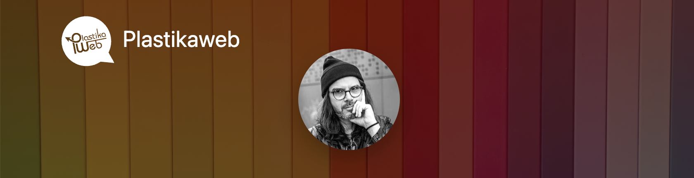

&nbsp;

## Hey 👋, I'm Carlos

&nbsp;

### Helping clients achieve success by sharing best-practice solutions

I'm a `freelancer frontend developer` with over 16 years of expertise in web development. Here's a little bit about me and what I can offer:

- Main specialties: `Angular`, `NX`, and @`ngrx`.

- Approach: I'm a creative problem solver who is dedicated to delivering results that usually exceed my clients' expectations.

- Focus: Whether working independently or in a team, I always keep the final product in mind and I am committed to delivering solutions that look great and are accessible to all users by applying clean code.

- Passion: I'm a motivated individual who seeks to use my creative abilities and grow as a person and a professional. I love generating new ideas and seeing them through to completion.

- Assets: My great assets are organization, communication, and the ability to learn quickly.
As a developer, I believe that being `creative` and having a `focus on the client and the final product` is the key.

<table><tr><td valign="top" width="50%">

- 🌱 I’m currently learning `NX generators`, and `typescript` and `web accessibility` at <a href="https://frontendmasters.com" target="_blank">FrontendMasters</a>.

- ❓ Ask me about anything related to `angular`, `Nx` and related technologies.

- ✉️ Contact me at <info@plastikaweb.com> .

- 📄 Take a look at <a href="https://www.plastikaweb.com" target="_blank">www.plastikaweb.com</a> and my <a href="https://www.plastikaweb.com/assets/docs/carlos_matheu_plastikaweb.pdf" target="_blank">CV</a>.

</td><td valign="top" width="50%">

A great starting point to get a feel for my coding style and approach:

</td></tr></table>

 

## Languages and Tools

### Third party libaries I've worked with in an angular environment

<ul align="left">
     <li><a target="_blank" style="margin: 10px" href="https://formly.dev/">ngx-formly</a></li>
     <li><a target="_blank" style="margin: 10px" href="https://github.com/assuncaocharles/ngx-indexed-db">ngx-indexed-db</a></li>
     <li><a target="_blank" style="margin: 10px" href="https://github.com/czeckd/angular-svg-icon">angular-svg-icon</a></li>
     <li><a target="_blank" style="margin: 10px" href="https://fontawesome.com">font-awesome</a></li>
     <li><a target="_blank" style="margin: 10px" href="https://the-guild.dev/graphql/apollo-angular">apollo-angular</a></li>
     <li><a target="_blank" style="margin: 10px" href="https://docs.amplify.aws/">AWS-amplify / cognito</a></li>
     <li><a target="_blank" style="margin: 10px" href="https://github.com/swimlane/ngx-charts">ngx-charts</a></li>
     <li><a target="_blank" style="margin: 10px" href="https://valor-software.com/ngx-bootstrap">ngx-bootstrap</a></li>
     <li><a target="_blank" style="margin: 10px" href="https://primeng.org/">primeNG</a></li>
     <li><a target="_blank" style="margin: 10px" href="https://github.com/swimlane/ngx-datatable">ngx-datatable</a></li>
     <li><a target="_blank" style="margin: 10px" href="https://github.com/brix/crypto-js">crypto-js</a></li>
     <li><a target="_blank" style="margin: 10px" href="https://github.com/ngx-translate/core">ngx-translate</a></li>
     <li><a target="_blank" style="margin: 10px" href="https://github.com/angular/flex-layout">flex-layout</a></li>
     <li><a target="_blank" style="margin: 10px" href="https://github.com/compodoc/compodoc">compodoc</a></li>
     <li><a target="_blank" style="margin: 10px" href="https://github.com/firebase/geofire-js">firebase/geofire</a></li>
     <li><a target="_blank" style="margin: 10px" href="https://leafletjs.com">leaflet</a></li>
     <li><a target="_blank" style="margin: 10px" href="https://github.com/stevermeister/ngx-cookie-service">ngx-cookie-service</a></li>
     <li><a target="_blank" style="margin: 10px" href="https://github.com/apexcharts/ng-apexcharts">ng-apexcharts</a></li>
</ul>

 

## Github Stats

&nbsp;

## Profile Trophies

  

----

